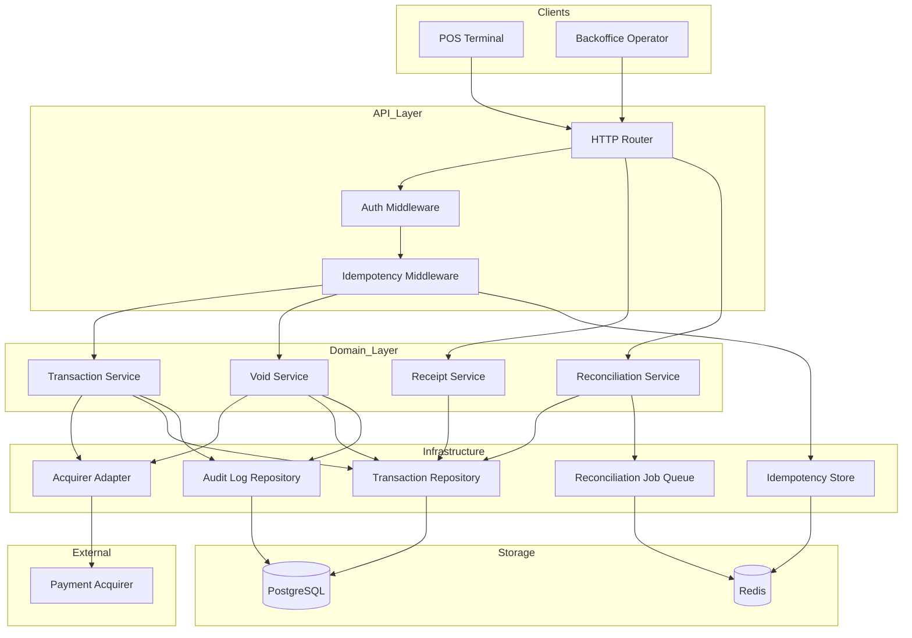
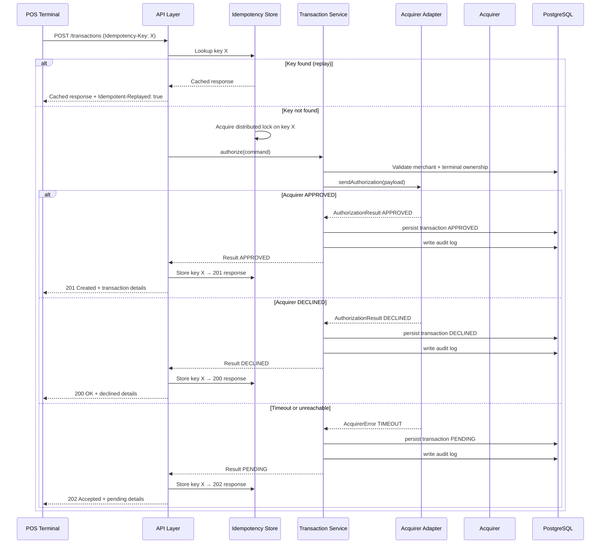
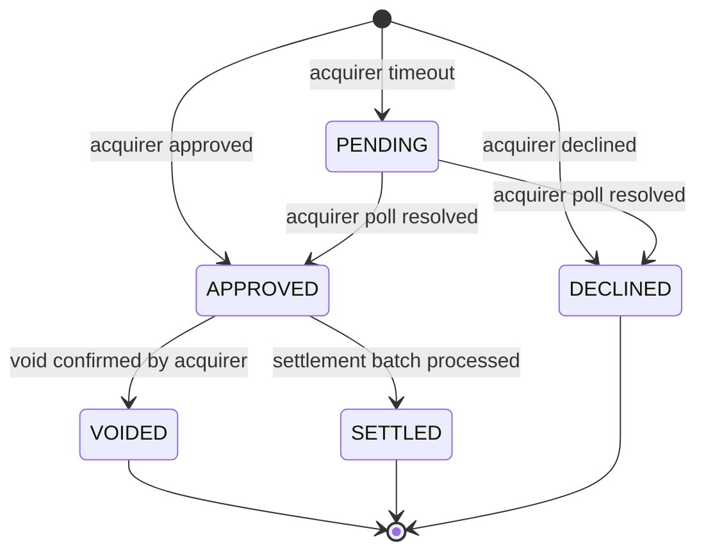
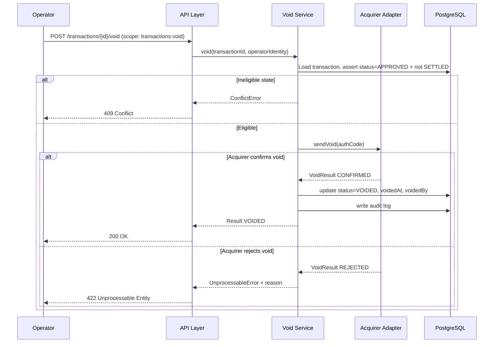
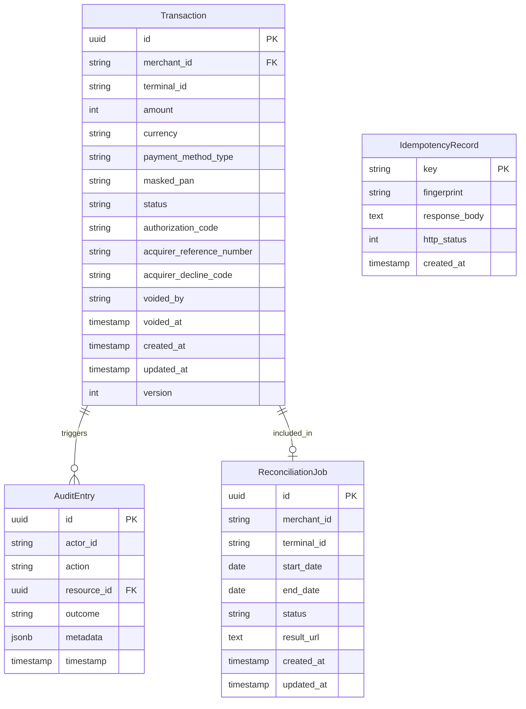

# Technical Design — POS Transactions API

---

## Overview

The POS Transactions API is a greenfield REST service that authorizes payment transactions at the Point-of-Sale, issues receipts, and exposes reconciliation data for backoffice settlement. It acts as the sole orchestration layer between POS terminals (merchants) and the external payment acquirer, persisting every outcome as an immutable financial record.

**Purpose**: This feature delivers secure, auditable payment authorization, receipt issuance, and acquirer reconciliation to merchants, customers, and backoffice operators.

**Users**: Merchants (PDV operators) consume the authorization, void, and receipt endpoints; backoffice operators consume the reconciliation endpoint; automated terminals consume all endpoints programmatically via JWT-secured API calls.

**Impact**: Establishes the core transactional backbone of the fintech POS platform. All future product capabilities (installments, loyalty, chargeback management) will extend or reference the transaction records produced by this service.

### Goals

- Authorize, decline, and pend payment transactions with a reliable acquirer integration backed by circuit-breaking and timeout handling.
- Provide idempotent authorization to protect merchants from double-charges on network retries.
- Expose a fully auditable transaction lifecycle (APPROVED → VOIDED / SETTLED, PENDING resolution) traceable per operator action.
- Enforce fine-grained JWT-based authorization (scopes `transactions:void`, `reconciliation:read`) with tenant isolation per merchant.
- Deliver structured observability (structured JSON logs + OpenTelemetry traces) across all external acquirer calls.

### Non-Goals

- POS terminal frontend or device SDK (out of scope).
- Direct card-network (Visa/Mastercard) integration — all card traffic routes through the acquirer.
- Settlement execution — this service exposes reconciliation data; the acquirer performs the actual settlement.
- Installment plan management or loyalty/rewards processing.
- Chargeback dispute lifecycle management.

---

## Architecture

### Architecture Pattern & Boundary Map

Selected pattern: **Layered Hexagonal (Ports & Adapters)** with an Express/Fastify HTTP transport layer, a domain service layer, and infrastructure adapters for persistence and external calls. This pattern isolates the acquirer integration behind a port, enabling the adapter to be swapped or mocked independently.



**Key Decisions**:
- Fastify v5 is preferred over Express for its built-in JSON-schema validation, TypeScript-first generics, and 2–3x higher throughput — critical for latency-sensitive authorization calls (requirement 1.1: ≤30 s response SLA).
- Domain services are stateless and do not depend on transport concerns; they receive typed command objects and return typed result unions.
- The Acquirer Adapter wraps Opossum circuit breaker to handle gateway timeouts and produce `PENDING` outcomes (requirements 1.6, 7.x).
- Redis stores idempotency keys with 24-hour TTL and acquirer-call distributed locks (Redlock) to prevent duplicate processing under concurrency (requirement 7.2).
- BullMQ (Redis-backed) handles asynchronous reconciliation exports when result sets are large (requirement 5.5).

### Technology Stack

| Layer | Choice / Version | Role in Feature | Notes |
|-------|-----------------|-----------------|-------|
| Backend / HTTP | Fastify v5 + TypeScript 5.x | HTTP transport, schema validation, lifecycle hooks | Replaces Express; first-class TS generics; JSON-schema validation built-in |
| Runtime | Node.js 20 LTS | Execution environment | Aligns with steering; async I/O for acquirer calls |
| ORM / Query | Prisma 5.x | Database schema, migrations, typed queries | Strong TypeScript codegen; migration tooling |
| Data / Primary | PostgreSQL 16 | Transactional persistence of all financial records | ACID guarantees, CHECK constraints for state transitions |
| Data / Cache & Queue | Redis 7 (via ioredis) | Idempotency key store (TTL 24 h), BullMQ job broker | Single Redis instance for both concerns in initial phase |
| Job Queue | BullMQ 5.x | Asynchronous reconciliation export jobs | TypeScript-native, Redis-backed, retries built-in |
| Auth | jsonwebtoken + custom scope middleware | JWT validation and permission-scope enforcement | No external IdP dependency initially; public-key RS256 verification |
| Circuit Breaker | Opossum 8.x | Wrap acquirer HTTP calls; open circuit on repeated timeouts | opossum-prometheus integration for circuit-state metrics |
| Observability | @opentelemetry/sdk-node + pino | Distributed traces propagated to acquirer; structured JSON logs | Aligns with steering OTel directive |
| HTTP Client | got v14 (ESM) or undici | Acquirer outbound calls with timeout configuration | Undici preferred for native Node.js HTTP/2 support |
| API Contract | OpenAPI 3.1 (fastify-swagger) | Auto-generated spec from Fastify JSON schemas | Aligns with steering REST + OpenAPI 3.1 standard |

---

## System Flows

### Authorization Flow



### Transaction State Machine



**Key Decisions**: SETTLED is a terminal state written externally by the settlement batch; the API does not transition to SETTLED directly. VOIDED can only originate from APPROVED and requires acquirer confirmation (requirements 3.1, 3.2). PENDING persists until the next poll resolves it (requirements 2.3, 2.4).

### Void Flow (abbreviated)



---

## Requirements Traceability

| Requirement | Summary | Components | Interfaces | Flows |
|-------------|---------|------------|------------|-------|
| 1.1 | Authorization ≤30 s response | Transaction Service, Acquirer Adapter | `authorize()`, `POST /transactions` | Authorization Flow |
| 1.2 | Field validation before acquirer call | Transaction Service, API Layer | Fastify JSON schema, `authorize()` preconditions | — |
| 1.3 | HTTP 422 on invalid fields | API Layer (schema validation) | Fastify error serializer | — |
| 1.4 | Persist APPROVED + HTTP 201 | Transaction Service, Transaction Repository | `persistTransaction()` | Authorization Flow |
| 1.5 | Persist DECLINED + HTTP 200 | Transaction Service, Transaction Repository | `persistTransaction()` | Authorization Flow |
| 1.6 | Persist PENDING + HTTP 202 on timeout | Acquirer Adapter (circuit breaker), Transaction Service | `sendAuthorization()`, Opossum timeout | Authorization Flow |
| 1.7 | Credit, debit, contactless (NFC) payment methods | Domain Model (`PaymentMethodType` enum) | `TransactionCommand.paymentMethod` | — |
| 1.8 | Amount in smallest currency unit (integer) | Domain Model (`MonetaryAmount` value object) | All monetary fields typed as `number` (integer cents) | — |
| 2.1 | Status query by transaction ID | Transaction Service, Transaction Repository | `GET /transactions/{id}` | — |
| 2.2 | HTTP 404 for unknown or cross-tenant ID | Transaction Repository tenant check | `findById()` with merchant isolation | — |
| 2.3 | PENDING returns latest status + last check timestamp | Transaction Repository | `GET /transactions/{id}` response | — |
| 2.4 | PENDING resolved on next poll | Transaction Service background update | `GET /transactions/{id}` + acquirer re-check | — |
| 2.5 | Paginated list with filters | Transaction Repository | `GET /transactions` with `terminalId`, `dateRange`, `status` | — |
| 3.1 | Void APPROVED pre-settlement → VOIDED | Void Service, Acquirer Adapter | `void()`, `POST /transactions/{id}/void` | Void Flow |
| 3.2 | HTTP 409 for VOIDED/SETTLED/DECLINED | Void Service | `void()` precondition check | Void Flow |
| 3.3 | Record voidedAt + voidedBy operator | Transaction Repository, Audit Log Repository | `persistVoid()` | Void Flow |
| 3.4 | HTTP 422 + reason if acquirer rejects void | Acquirer Adapter, Void Service | `sendVoid()` error handling | Void Flow |
| 3.5 | `transactions:void` scope required | Auth Middleware | `requireScope('transactions:void')` | — |
| 4.1 | Receipt payload for APPROVED/VOIDED | Receipt Service | `GET /transactions/{id}/receipt` | — |
| 4.2 | HTTP 409 for DECLINED/PENDING receipt | Receipt Service | `getReceipt()` state guard | — |
| 4.3 | JSON receipt output | Receipt Service | `ReceiptPayload` typed response | — |
| 4.4 | Template-based receipt rendering | Receipt Service | `MerchantConfig.receiptTemplateId` | — |
| 4.5 | PAN masked to last 4 digits | Domain Model (`MaskedPan` value object) | Applied at persistence + response serialization | — |
| 5.1 | Reconciliation list APPROVED+VOIDED with totals | Reconciliation Service, Transaction Repository | `GET /reconciliation` | — |
| 5.2 | `reconciliation:read` scope required | Auth Middleware | `requireScope('reconciliation:read')` | — |
| 5.3 | HTTP 400 for date range >31 days | Reconciliation Service | `getReconciliation()` input validation | — |
| 5.4 | Reconciliation record fields | Reconciliation Service | `ReconciliationRecord` type | — |
| 5.5 | Async export job with polling | Reconciliation Job Queue (BullMQ), Job Status Endpoint | `POST /reconciliation/jobs`, `GET /reconciliation/jobs/{id}` | — |
| 6.1 | JWT bearer token on every protected endpoint | Auth Middleware | `verifyJwt()` | — |
| 6.2 | HTTP 401 on missing/expired token | Auth Middleware | JWT error handler | — |
| 6.3 | HTTP 403 on missing scope | Auth Middleware | `requireScope()` | — |
| 6.4 | Tenant isolation per merchant | Transaction Repository | All queries filter by `merchantId` from JWT claims | — |
| 6.5 | HTTP 403 for suspended account | Auth Middleware | `checkMerchantStatus()` | — |
| 7.1 | Idempotency-Key deduplication within 24 h | Idempotency Middleware, Idempotency Store | `checkIdempotency()`, Redis TTL 24 h | Authorization Flow |
| 7.2 | HTTP 409 on concurrent duplicate key | Idempotency Store (Redlock) | Distributed lock on key | Authorization Flow |
| 7.3 | Store idempotency keys ≥24 h | Idempotency Store | Redis TTL = 86400 s | — |
| 7.4 | `Idempotent-Replayed: true` header | Idempotency Middleware | Response header injection | — |
| 8.1 | Structured JSON logs per request/response | Pino + Fastify hooks | `onRequest` / `onResponse` hooks | — |
| 8.2 | OpenTelemetry trace propagation | OTel SDK auto-instrumentation + Acquirer Adapter | W3C Trace-Context headers on acquirer calls | — |
| 8.3 | Immutable audit log on auth/void/reconciliation | Audit Log Repository | `writeAuditEntry()` | Authorization + Void Flows |
| 8.4 | Non-blocking audit log failure with critical alert | Audit Log Repository | Fire-and-forget + error event to OTel | — |
| 8.5 | Unauthenticated `/health` endpoint | API Layer | `GET /health` | — |

---

## Components and Interfaces

### Summary Table

| Component | Domain/Layer | Intent | Req Coverage | Key Dependencies (P0/P1) | Contracts |
|-----------|-------------|--------|--------------|--------------------------|-----------|
| Auth Middleware | Infrastructure/HTTP | JWT validation + scope enforcement + tenant check | 6.1–6.5 | jsonwebtoken (P0) | Service |
| Idempotency Middleware | Infrastructure/HTTP | Deduplication of authorization requests | 7.1–7.4 | Idempotency Store (P0) | Service |
| Transaction Service | Domain | Orchestrates authorization lifecycle | 1.1–1.8 | Acquirer Adapter (P0), Transaction Repo (P0) | Service |
| Void Service | Domain | Orchestrates void lifecycle | 3.1–3.5 | Acquirer Adapter (P0), Transaction Repo (P0) | Service |
| Receipt Service | Domain | Composes and renders transaction receipts | 4.1–4.5 | Transaction Repo (P0) | Service |
| Reconciliation Service | Domain | Generates reconciliation data; dispatches async jobs | 5.1–5.5 | Transaction Repo (P0), Job Queue (P1) | Service, Batch |
| Acquirer Adapter | Infrastructure/External | HTTP gateway to payment acquirer with circuit breaker | 1.1, 1.6, 3.1, 3.4 | Acquirer (P0), Opossum (P0) | Service |
| Transaction Repository | Infrastructure/Data | CRUD and query operations on transaction records | 1.4–2.5, 3.x, 4.x, 5.x | PostgreSQL (P0) | Service |
| Audit Log Repository | Infrastructure/Data | Append-only audit entry persistence | 8.3, 8.4 | PostgreSQL (P0) | Service |
| Idempotency Store | Infrastructure/Cache | Redis-backed key/response cache with TTL + Redlock | 7.1–7.4 | Redis (P0) | Service, State |
| Reconciliation Job Queue | Infrastructure/Queue | BullMQ job dispatch and status for async exports | 5.5 | Redis (P0), BullMQ (P0) | Batch |

---

### HTTP / API Layer

#### Auth Middleware

| Field | Detail |
|-------|--------|
| Intent | Verify RS256 JWT, extract claims, enforce permission scopes, and validate merchant account status on every protected request |
| Requirements | 6.1, 6.2, 6.3, 6.4, 6.5 |

**Responsibilities & Constraints**
- Verify token signature against a configured RS256 public key; reject expired tokens.
- Extract `merchantId`, `terminalId`, and `scopes` from JWT claims.
- Inject verified claims into request context for downstream components.
- Block requests from merchants with `accountStatus !== 'ACTIVE'`.

**Dependencies**
- Inbound: HTTP Router — every request (P0)
- External: jsonwebtoken ^9 — RS256 signature verification (P0)

**Contracts**: Service [x]

##### Service Interface
```typescript
interface AuthContext {
  merchantId: string;
  terminalId: string | null;
  scopes: string[];
  accountStatus: 'ACTIVE' | 'INACTIVE' | 'SUSPENDED';
}

interface AuthMiddleware {
  verifyJwt(token: string): Result<AuthContext, AuthError>;
  requireScope(scope: string): FastifyPreHandlerHookHandler;
  checkMerchantStatus(context: AuthContext): Result<void, AuthError>;
}

type AuthError =
  | { code: 'TOKEN_MISSING' | 'TOKEN_EXPIRED' | 'TOKEN_INVALID'; httpStatus: 401 }
  | { code: 'SCOPE_MISSING' | 'ACCOUNT_SUSPENDED' | 'ACCOUNT_INACTIVE'; httpStatus: 403; reason?: string };
```

- Preconditions: `Authorization: Bearer <token>` header present.
- Postconditions: `request.authContext` populated; downstream handlers receive a non-null `AuthContext`.
- Invariants: A request that reaches a domain handler has a verified `AuthContext`.

**Implementation Notes**
- Integration: Mount as a Fastify `onRequest` hook on all routes except `GET /health`.
- Validation: Public key loaded from environment variable at startup; fail-fast if missing.
- Risks: Key rotation must be coordinated; consider JWKS endpoint as future migration path (document in `research.md`).

---

#### Idempotency Middleware

| Field | Detail |
|-------|--------|
| Intent | Detect duplicate `POST /transactions` requests within 24 h and replay original response without re-processing |
| Requirements | 7.1, 7.2, 7.3, 7.4 |

**Responsibilities & Constraints**
- Extract `Idempotency-Key` header; pass through if absent (key is required for POST /transactions by schema).
- Attempt to acquire a Redlock distributed lock before processing; return HTTP 409 if lock cannot be acquired (concurrent duplicate).
- After successful processing, persist key → serialized response in Redis with TTL 86400 s.

**Dependencies**
- Inbound: HTTP Router — `POST /transactions` (P0)
- Outbound: Idempotency Store — key lookup and storage (P0)

**Contracts**: Service [x]

##### Service Interface
```typescript
interface IdempotencyMiddleware {
  check(key: string, requestFingerprint: string): Promise<Result<IdempotencyHit | null, IdempotencyError>>;
  store(key: string, response: SerializedResponse): Promise<void>;
  acquireLock(key: string): Promise<Result<Lock, IdempotencyError>>;
  releaseLock(lock: Lock): Promise<void>;
}

interface IdempotencyHit {
  response: SerializedResponse;
  replayed: true;
}

type IdempotencyError =
  | { code: 'CONCURRENT_REQUEST'; httpStatus: 409 }
  | { code: 'STORE_UNAVAILABLE'; httpStatus: 503 };
```

- Preconditions: Redis reachable; `Idempotency-Key` is a non-empty string (validated by route schema).
- Postconditions: For replays, response headers include `Idempotent-Replayed: true`.
- Invariants: At most one transaction is created per unique idempotency key within the 24-hour window.

**Implementation Notes**
- Integration: Applied as a Fastify `preHandler` hook on `POST /transactions` only.
- Risks: Redis unavailability must not block authorization; implement a safe-mode fallback that skips idempotency checking and logs a warning (document degraded-mode behavior in `research.md`).

---

### Domain Layer

#### Transaction Service

| Field | Detail |
|-------|--------|
| Intent | Orchestrate the full authorization lifecycle: validate input, call acquirer, persist outcome, write audit log |
| Requirements | 1.1, 1.2, 1.3, 1.4, 1.5, 1.6, 1.7, 1.8 |

**Responsibilities & Constraints**
- Accept a `AuthorizeCommand` from the HTTP layer; enforce all business invariants before forwarding to the acquirer.
- Determine final transaction status from `AcquirerResult` (APPROVED / DECLINED / PENDING).
- Persist transaction record and audit entry atomically within a single PostgreSQL transaction.
- Never expose raw acquirer error details to callers; normalize into typed error envelopes.

**Dependencies**
- Inbound: Auth Middleware + Idempotency Middleware → HTTP Router (P0)
- Outbound: Acquirer Adapter — submit authorization (P0)
- Outbound: Transaction Repository — persist record (P0)
- Outbound: Audit Log Repository — write audit entry (P1)

**Contracts**: Service [x]

##### Service Interface
```typescript
interface AuthorizeCommand {
  merchantId: string;
  terminalId: string;
  amount: number;           // integer, smallest currency unit
  currency: string;         // ISO 4217
  paymentMethod: PaymentMethodInput;
  idempotencyKey: string;
}

interface PaymentMethodInput {
  type: 'CREDIT_CARD' | 'DEBIT_CARD' | 'CONTACTLESS_NFC';
  maskedPan: MaskedPan;     // last-4 only stored
  expiryMonth: number;
  expiryYear: number;
}

interface TransactionResult {
  transactionId: string;
  status: TransactionStatus;
  authorizationCode: string | null;
  acquirerDeclineCode: string | null;
  createdAt: string;        // ISO 8601
  updatedAt: string;
}

interface TransactionService {
  authorize(command: AuthorizeCommand): Promise<Result<TransactionResult, TransactionError>>;
  getById(transactionId: string, merchantId: string): Promise<Result<TransactionRecord, TransactionError>>;
  list(filters: TransactionListFilters): Promise<Result<PaginatedList<TransactionRecord>, TransactionError>>;
}

type TransactionError =
  | { code: 'VALIDATION_ERROR'; fields: FieldError[]; httpStatus: 422 }
  | { code: 'NOT_FOUND'; httpStatus: 404 }
  | { code: 'ACQUIRER_TIMEOUT'; httpStatus: 202 }
  | { code: 'INTERNAL_ERROR'; httpStatus: 500 };
```

- Preconditions: `AuthorizeCommand` fields all present and validated; `merchantId` matches JWT claim.
- Postconditions: Exactly one `Transaction` record created; exactly one `AuditEntry` created.
- Invariants: Amount is a positive integer; currency is a 3-letter ISO 4217 code; `maskedPan` contains only last 4 digits.

**Implementation Notes**
- Integration: Persist transaction + audit log in the same Prisma transaction to ensure atomicity.
- Validation: Amount > 0, currency matches ISO 4217 allowlist; perform terminal ownership check against `merchantId`.
- Risks: Acquirer timeout during persistence window — handle by catching post-persist failures and triggering compensating audit log entry at domain level.

---

#### Void Service

| Field | Detail |
|-------|--------|
| Intent | Orchestrate transaction void: validate eligibility, call acquirer, update status, record operator identity |
| Requirements | 3.1, 3.2, 3.3, 3.4, 3.5 |

**Responsibilities & Constraints**
- Load the target transaction; assert status is `APPROVED` and not `SETTLED`.
- Forward void request to acquirer; update status to `VOIDED` only on acquirer confirmation.
- Retain original status unchanged on acquirer rejection.

**Dependencies**
- Inbound: HTTP Router (scope `transactions:void`) (P0)
- Outbound: Acquirer Adapter — submit void (P0)
- Outbound: Transaction Repository — load + update record (P0)
- Outbound: Audit Log Repository — void audit entry (P1)

**Contracts**: Service [x]

##### Service Interface
```typescript
interface VoidCommand {
  transactionId: string;
  merchantId: string;
  operatorId: string;
}

interface VoidResult {
  transactionId: string;
  status: 'VOIDED';
  voidedAt: string;
  voidedBy: string;
}

interface VoidService {
  void(command: VoidCommand): Promise<Result<VoidResult, VoidError>>;
}

type VoidError =
  | { code: 'NOT_ELIGIBLE'; currentStatus: TransactionStatus; httpStatus: 409 }
  | { code: 'ACQUIRER_REJECTED'; reason: string; httpStatus: 422 }
  | { code: 'NOT_FOUND'; httpStatus: 404 };
```

- Preconditions: JWT scope `transactions:void` present; transaction belongs to `merchantId`.
- Postconditions: On success, `transaction.status = 'VOIDED'`, `transaction.voidedAt` and `transaction.voidedBy` populated.
- Invariants: Status transitions only via state machine rules (see Transaction State Machine diagram).

---

#### Receipt Service

| Field | Detail |
|-------|--------|
| Intent | Compose and return a typed receipt payload for APPROVED or VOIDED transactions |
| Requirements | 4.1, 4.2, 4.3, 4.4, 4.5 |

**Responsibilities & Constraints**
- Assert target transaction status is `APPROVED` or `VOIDED` before composing receipt.
- Apply merchant receipt template if configured; fall back to default template.
- PAN in receipt payload must be the `MaskedPan` value object (last 4 digits only).

**Dependencies**
- Inbound: HTTP Router (P0)
- Outbound: Transaction Repository (P0)

**Contracts**: Service [x]

##### Service Interface
```typescript
interface ReceiptPayload {
  transactionId: string;
  merchantName: string;
  terminalId: string;
  amount: number;
  currency: string;
  paymentMethodType: 'CREDIT_CARD' | 'DEBIT_CARD' | 'CONTACTLESS_NFC';
  maskedPan: string;          // last 4 digits, e.g. "****1234"
  authorizationCode: string | null;
  transactionTimestamp: string;
  receiptTemplate: string | null;
}

interface ReceiptService {
  getReceipt(transactionId: string, merchantId: string): Promise<Result<ReceiptPayload, ReceiptError>>;
}

type ReceiptError =
  | { code: 'NOT_AVAILABLE'; currentStatus: TransactionStatus; httpStatus: 409 }
  | { code: 'NOT_FOUND'; httpStatus: 404 };
```

---

#### Reconciliation Service

| Field | Detail |
|-------|--------|
| Intent | Return reconciliation data for a settlement period or dispatch an asynchronous export job for large result sets |
| Requirements | 5.1, 5.2, 5.3, 5.4, 5.5 |

**Responsibilities & Constraints**
- Validate date range ≤ 31 days; return HTTP 400 otherwise.
- For small result sets: return inline synchronously.
- For large result sets: enqueue a BullMQ job and return a job ID for polling.
- Each record includes: `transactionId`, `amount`, `currency`, `paymentMethodType`, `authorizationCode`, `settlementStatus`, `acquirerReferenceNumber`.

**Dependencies**
- Inbound: HTTP Router (scope `reconciliation:read`) (P0)
- Outbound: Transaction Repository (P0)
- Outbound: Reconciliation Job Queue (P1)

**Contracts**: Service [x], Batch [x]

##### Service Interface
```typescript
interface ReconciliationQuery {
  merchantId: string;
  terminalId?: string;
  startDate: string;          // ISO 8601 date
  endDate: string;
  pageSize?: number;
}

interface ReconciliationRecord {
  transactionId: string;
  amount: number;
  currency: string;
  paymentMethodType: 'CREDIT_CARD' | 'DEBIT_CARD' | 'CONTACTLESS_NFC';
  authorizationCode: string;
  settlementStatus: 'PENDING_SETTLEMENT' | 'SETTLED';
  acquirerReferenceNumber: string;
}

interface ReconciliationSummary {
  records: ReconciliationRecord[];
  totalsByMethod: Record<string, number>;  // key: paymentMethodType, value: total amount in cents
  generatedAt: string;
}

interface ReconciliationJob {
  jobId: string;
  status: 'QUEUED' | 'PROCESSING' | 'COMPLETED' | 'FAILED';
  resultUrl: string | null;
}

interface ReconciliationService {
  getReconciliation(query: ReconciliationQuery): Promise<Result<ReconciliationSummary, ReconciliationError>>;
  createExportJob(query: ReconciliationQuery): Promise<Result<ReconciliationJob, ReconciliationError>>;
  getJobStatus(jobId: string): Promise<Result<ReconciliationJob, ReconciliationError>>;
}

type ReconciliationError =
  | { code: 'DATE_RANGE_EXCEEDED'; maxDays: 31; httpStatus: 400 }
  | { code: 'FORBIDDEN'; httpStatus: 403 };
```

##### Batch / Job Contract
- Trigger: `POST /reconciliation/jobs` when estimated result set exceeds a configurable threshold (default: 10,000 records).
- Input: `ReconciliationQuery` serialized into BullMQ job data.
- Output: Written to a signed S3/blob URL or a streaming endpoint; job record updated to `COMPLETED` with `resultUrl`.
- Idempotency & recovery: BullMQ job IDs are UUID-based; duplicate job submissions for the same query within 1 hour are deduplicated by job name hash.

---

### Infrastructure Layer

#### Acquirer Adapter

| Field | Detail |
|-------|--------|
| Intent | Translate domain authorization and void commands into acquirer HTTP calls; wrap with circuit breaker and timeout handling |
| Requirements | 1.1, 1.6, 3.1, 3.4, 8.2 |

**Responsibilities & Constraints**
- Serialize `AuthorizeCommand` to acquirer-specific request format; deserialize acquirer response into `AcquirerResult`.
- Apply Opossum circuit breaker: timeout 25 s (below 30 s SLA), `errorThresholdPercentage` 50%, `resetTimeout` 30 s.
- Propagate W3C Trace-Context headers on all outbound HTTP calls (requirement 8.2).
- On timeout, produce `AcquirerResult { outcome: 'TIMEOUT' }` — never let the circuit throw to domain layer without a typed result.

**Dependencies**
- Inbound: Transaction Service, Void Service (P0)
- External: Payment Acquirer REST API (P0)
- External: Opossum ^8 circuit breaker (P0)
- External: undici / got v14 HTTP client (P0)

**Contracts**: Service [x]

##### Service Interface
```typescript
interface AcquirerAuthRequest {
  merchantId: string;
  terminalId: string;
  amount: number;
  currency: string;
  paymentMethodType: 'CREDIT_CARD' | 'DEBIT_CARD' | 'CONTACTLESS_NFC';
  maskedPan: string;
  traceContext: W3CTraceContext;
}

interface AcquirerVoidRequest {
  authorizationCode: string;
  originalAmount: number;
  traceContext: W3CTraceContext;
}

interface AcquirerResult {
  outcome: 'APPROVED' | 'DECLINED' | 'TIMEOUT' | 'ERROR';
  authorizationCode: string | null;
  acquirerReferenceNumber: string | null;
  declineCode: string | null;
  rawResponseCode: string | null;
}

interface AcquirerAdapter {
  authorize(request: AcquirerAuthRequest): Promise<Result<AcquirerResult, AcquirerAdapterError>>;
  void(request: AcquirerVoidRequest): Promise<Result<AcquirerResult, AcquirerAdapterError>>;
}

type AcquirerAdapterError =
  | { code: 'CIRCUIT_OPEN'; httpStatus: 503 }
  | { code: 'SERIALIZATION_ERROR'; httpStatus: 500 };
```

**Implementation Notes**
- Integration: Acquirer base URL and credentials loaded from environment variables; never hardcoded.
- Risks: Acquirer API contract is not yet finalized — the adapter interface is defined; the concrete HTTP mapping is deferred to implementation and documented in `research.md`. The port/adapter pattern isolates this risk.

---

#### Transaction Repository

| Field | Detail |
|-------|--------|
| Intent | Persist and query transaction records with tenant isolation and optimistic-locking for concurrent updates |
| Requirements | 1.4, 1.5, 1.6, 2.1–2.5, 3.1–3.4, 4.1, 5.1, 5.4 |

**Dependencies**
- Inbound: Transaction Service, Void Service, Receipt Service, Reconciliation Service (P0)
- External: PostgreSQL 16 via Prisma 5 (P0)

**Contracts**: Service [x]

##### Service Interface
```typescript
interface TransactionListFilters {
  merchantId: string;
  terminalId?: string;
  status?: TransactionStatus;
  dateFrom?: Date;
  dateTo?: Date;
  page: number;
  pageSize: number;
}

interface PaginatedList<T> {
  items: T[];
  total: number;
  page: number;
  pageSize: number;
}

interface TransactionRepository {
  create(data: CreateTransactionData): Promise<TransactionRecord>;
  findById(id: string, merchantId: string): Promise<TransactionRecord | null>;
  updateStatus(id: string, status: TransactionStatus, metadata?: Partial<TransactionRecord>): Promise<TransactionRecord>;
  list(filters: TransactionListFilters): Promise<PaginatedList<TransactionRecord>>;
  listForReconciliation(query: ReconciliationQuery): Promise<ReconciliationRecord[]>;
}
```

**Implementation Notes**
- All queries include `WHERE merchant_id = $merchantId` to enforce tenant isolation (requirement 6.4).
- `updateStatus` uses optimistic locking via Prisma `version` field to prevent concurrent state corruption.

---

#### Audit Log Repository

| Field | Detail |
|-------|--------|
| Intent | Append-only persistence of audit entries; failures must not propagate to business operations |
| Requirements | 8.3, 8.4 |

**Dependencies**
- Inbound: Transaction Service, Void Service (P1)
- External: PostgreSQL 16 via Prisma (P0)

**Contracts**: Service [x]

##### Service Interface
```typescript
interface AuditEntry {
  id: string;
  actorId: string;
  action: 'AUTHORIZE' | 'VOID' | 'RECONCILIATION_READ';
  resourceId: string;
  outcome: 'SUCCESS' | 'FAILURE';
  timestamp: string;
  metadata: Record<string, unknown>;
}

interface AuditLogRepository {
  write(entry: Omit<AuditEntry, 'id'>): Promise<void>;
}
```

- Postconditions: `write()` resolves successfully or silently catches errors and emits a critical OTel metric (never rejects to caller).
- Invariants: Audit records are never deleted or updated — append-only table with no `DELETE`/`UPDATE` grants.

---

#### Idempotency Store

| Field | Detail |
|-------|--------|
| Intent | Redis-backed store for idempotency key lookup, response caching with 24-hour TTL, and distributed lock management |
| Requirements | 7.1, 7.2, 7.3, 7.4 |

**Dependencies**
- Inbound: Idempotency Middleware (P0)
- External: Redis 7 via ioredis (P0)
- External: Redlock (distributed lock on Redis) (P0)

**Contracts**: Service [x], State [x]

##### State Management
- State model: Redis Hash per idempotency key: `{ response: string, fingerprint: string, createdAt: number }`.
- Persistence & consistency: TTL set atomically with `SET key value EX 86400 NX` to prevent overwrites.
- Concurrency strategy: Redlock acquires a short-lived lock (TTL 10 s) on `lock:{idempotencyKey}` before any new processing starts; concurrent request receives 409.

---

## Data Models

### Domain Model

**Aggregates**:
- `Transaction` — root aggregate; owns all state transitions; contains one `PaymentMethod` value object and zero-to-one `VoidInfo` entity.
- `AuditEntry` — independent append-only aggregate; no relations modified after creation.

**Value Objects**:
- `MonetaryAmount { amount: number; currency: string }` — invariant: `amount > 0`, `currency` in ISO 4217 allowlist.
- `MaskedPan { value: string }` — invariant: matches `/^\*{4,}\d{4}$/`; enforced at construction.
- `AuthorizationCode { value: string }` — immutable after set.

**Domain Events** (internal, not published externally in initial phase):
- `TransactionAuthorized { transactionId, merchantId, amount, currency, timestamp }`
- `TransactionVoided { transactionId, operatorId, timestamp }`
- `TransactionStatusResolved { transactionId, previousStatus, newStatus, timestamp }`

**Invariants**:
- A `PENDING` transaction can only transition to `APPROVED` or `DECLINED`.
- A `VOIDED` or `SETTLED` transaction cannot be voided again.
- `MaskedPan` never stores full card number; full PAN is never persisted.

### Logical Data Model



### Physical Data Model

**transactions table**:
- Primary key: `id UUID DEFAULT gen_random_uuid()`
- Indexes: `(merchant_id, created_at DESC)` for list queries; `(terminal_id, status, created_at)` for reconciliation filters; `(status)` partial index for PENDING polling.
- Constraints: `CHECK (status IN ('PENDING','APPROVED','DECLINED','VOIDED','SETTLED'))`, `CHECK (amount > 0)`.
- `version INTEGER NOT NULL DEFAULT 0` — optimistic locking; updated on every `updateStatus`.

**audit_entries table**:
- Primary key: `id UUID DEFAULT gen_random_uuid()`
- No foreign key constraint on `resource_id` (append-only; must tolerate orphans during failure scenarios).
- Index: `(resource_id, timestamp DESC)`.
- Row-level security: `REVOKE DELETE, UPDATE ON audit_entries FROM api_user`.

**reconciliation_jobs table**:
- Primary key: `id UUID DEFAULT gen_random_uuid()`
- Index: `(merchant_id, created_at DESC)`.

**IdempotencyRecord** is stored in Redis only (not PostgreSQL); no physical table.

### Data Contracts & Integration

**API Data Transfer — Key Schemas**:

`POST /transactions` Request:
```
{
  amount: integer (cents, > 0),
  currency: string (ISO 4217, 3 chars),
  paymentMethod: {
    type: "CREDIT_CARD" | "DEBIT_CARD" | "CONTACTLESS_NFC",
    maskedPan: string (last 4 digits),
    expiryMonth: integer (1-12),
    expiryYear: integer (current year or later)
  },
  terminalId: string,
  merchantId: string
}
```
Headers: `Idempotency-Key: <uuid>` (required), `Authorization: Bearer <jwt>`

`POST /transactions` Response (201 APPROVED):
```
{
  transactionId: string,
  status: "APPROVED",
  authorizationCode: string,
  acquirerReferenceNumber: string,
  createdAt: string (ISO 8601),
  updatedAt: string
}
```

All monetary values are integers in cents. PAN is always masked in responses. Serialization: JSON. Versioning: URI prefix `/v1/`.

---

## Error Handling

### Error Strategy

The API applies fail-fast validation at the HTTP schema layer (Fastify JSON schema) before reaching domain services. Domain errors are returned as typed `Result<T, E>` discriminated unions and mapped to HTTP status codes by a centralized error serializer.

### Error Categories and Responses

**User Errors (4xx)**:
- `422 Unprocessable Entity`: Schema validation failures — response body includes `{ errors: [{ field, message }] }`.
- `404 Not Found`: Transaction ID not found or cross-tenant access — generic message without leaking existence of records belonging to other merchants.
- `409 Conflict`: State-ineligible operations (void on non-APPROVED, receipt on PENDING/DECLINED, concurrent idempotency key).
- `400 Bad Request`: Reconciliation date range >31 days.
- `401 Unauthorized`: Missing or expired JWT.
- `403 Forbidden`: Scope missing or account suspended.

**Acquirer / External Errors**:
- `202 Accepted`: Acquirer unreachable or timeout — transaction persisted as PENDING; terminal should poll.
- `503 Service Unavailable`: Circuit breaker open — returned when Opossum trips; includes `Retry-After` header.

**System Errors (5xx)**:
- `500 Internal Server Error`: Unhandled exceptions; never expose stack traces. Correlation ID included in response body.

### Monitoring

- Every 4xx and 5xx response emits a Pino log at `warn`/`error` level with `correlationId`, `merchantId`, `terminalId`, `route`, and `statusCode`.
- OTel span created for each request; acquirer calls create child spans.
- Circuit breaker state changes (open/half-open/closed) emit OTel metrics via `opossum-prometheus`.
- Audit log write failures emit a critical-level OTel metric `audit_log_write_failures_total`.
- `GET /health` returns `{ status: "ok", uptime: number }` without authentication.

---

## Testing Strategy

### Unit Tests
- `TransactionService.authorize()`: APPROVED, DECLINED, PENDING outcomes; validation rejection; PAN masking.
- `VoidService.void()`: Eligible APPROVED → VOIDED; ineligible states (VOIDED, SETTLED, DECLINED) → 409; acquirer rejection → 422.
- `IdempotencyMiddleware`: Cache hit returns replay header; concurrent lock conflict returns 409; expired key treated as miss.
- `AcquirerAdapter`: Circuit breaker trips after threshold; timeout produces `TIMEOUT` outcome; W3C trace headers propagated.
- `MaskedPan` value object: Construction rejects full PANs; allows last-4 format only.

### Integration Tests
- `POST /transactions` full flow: Authorization → persistence → audit log → idempotency key stored.
- `POST /transactions/{id}/void` full flow: APPROVED → VOIDED; state guard rejects invalid transitions.
- `GET /reconciliation` with date range validation: >31 days → 400; valid range → records with method totals.
- JWT enforcement: Missing token → 401; valid token missing scope → 403; suspended merchant → 403.
- Concurrent idempotency: Two simultaneous requests with same key → one 201, one 409.

### Performance / Load
- Authorization endpoint P95 latency ≤ 5 s under 100 concurrent requests (acquirer stub responding in 1 s).
- Idempotency key Redis lookup adds ≤ 5 ms P99 overhead.
- Reconciliation query for 10,000 records completes within 3 s synchronously; beyond threshold dispatches job within 500 ms.

---

## Security Considerations

- **PAN Protection**: Full PAN is never received, stored, or logged. The `maskedPan` field is the only card identifier persisted. API schema rejects inputs where `maskedPan` appears to contain a full 16-digit number.
- **JWT Hardening**: RS256 (asymmetric) only; HS256 is rejected. `exp` and `iss` claims validated on every request. Public key loaded from environment variable; key rotation requires restart (JWKS migration path documented as future work).
- **Tenant Isolation**: All repository queries are parameterized with `merchantId` extracted from JWT claims; never from request body.
- **Audit Immutability**: `audit_entries` table has `DELETE`/`UPDATE` revoked at the DB role level, preventing tampering.
- **Secrets Management**: Acquirer credentials, JWT public key, and Redis connection strings loaded exclusively from environment variables; never committed to source.
- **Input Sanitization**: Fastify JSON schema validation rejects unexpected fields (`additionalProperties: false`) on all request bodies.
- **Rate Limiting**: Not specified in requirements; flag as open question — recommend adding per-merchant rate limiting at API gateway level before production.

---

## Performance & Scalability

- **Authorization SLA**: End-to-end ≤ 30 s (requirement 1.1). Acquirer Adapter timeout set to 25 s, leaving 5 s for internal processing. Internal P95 target ≤ 500 ms excluding acquirer call.
- **Stateless Services**: Transaction Service, Void Service, and Receipt Service are stateless; horizontal scaling via additional Node.js process instances behind a load balancer.
- **Database Indexing**: Compound indexes on `(merchant_id, created_at)` and `(terminal_id, status, created_at)` cover all primary query patterns.
- **Redis as Hot Cache**: Idempotency key lookups hit Redis before any PostgreSQL query; reduces DB load on retry storms.
- **Async Reconciliation**: Large exports offloaded to BullMQ workers to prevent long-running synchronous requests blocking the HTTP event loop.
- **Connection Pooling**: Prisma connection pool size configured per environment; PgBouncer recommended in production for connection multiplexing at scale.

---

## Supporting References

### A. Full API Endpoint Summary

| Method | Endpoint | Scope Required | Description |
|--------|----------|----------------|-------------|
| POST | /v1/transactions | — | Submit authorization |
| GET | /v1/transactions | — | List with filters (paginated) |
| GET | /v1/transactions/{id} | — | Get transaction by ID |
| POST | /v1/transactions/{id}/void | `transactions:void` | Void an APPROVED transaction |
| GET | /v1/transactions/{id}/receipt | — | Get receipt for APPROVED/VOIDED |
| GET | /v1/reconciliation | `reconciliation:read` | Inline reconciliation report |
| POST | /v1/reconciliation/jobs | `reconciliation:read` | Create async export job |
| GET | /v1/reconciliation/jobs/{id} | `reconciliation:read` | Poll async export job status |
| GET | /health | none | Liveness/readiness probe |

### B. Transaction Status Transition Rules

| From | To | Trigger |
|------|-----|---------|
| (new) | PENDING | Acquirer timeout |
| (new) | APPROVED | Acquirer approved |
| (new) | DECLINED | Acquirer declined |
| PENDING | APPROVED | Acquirer poll resolved approved |
| PENDING | DECLINED | Acquirer poll resolved declined |
| APPROVED | VOIDED | Void confirmed by acquirer |
| APPROVED | SETTLED | Settlement batch (external) |
